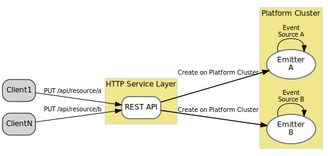
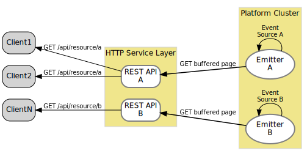
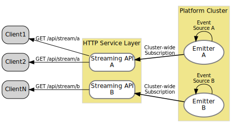
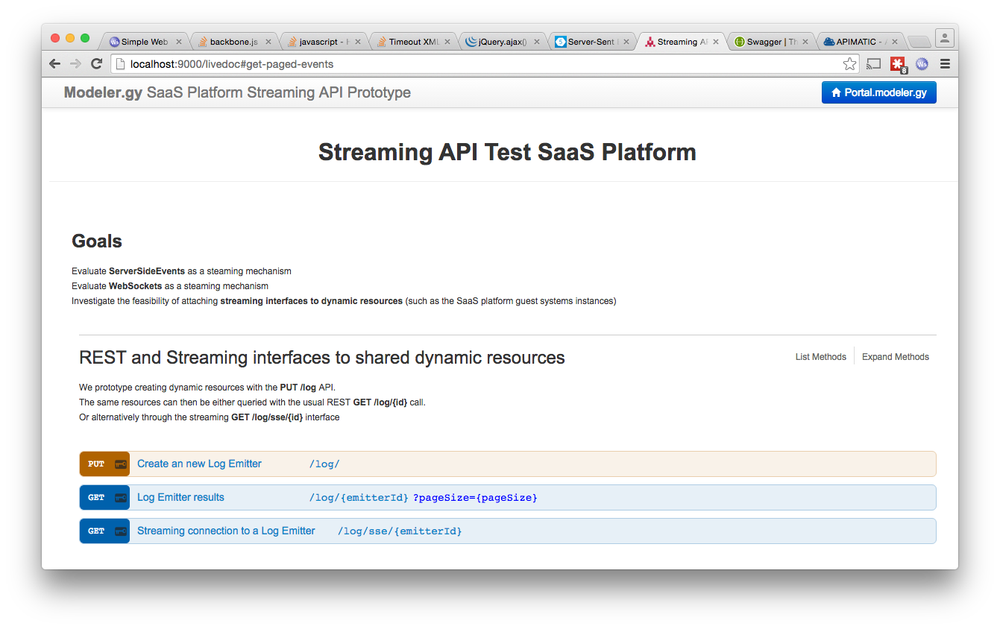
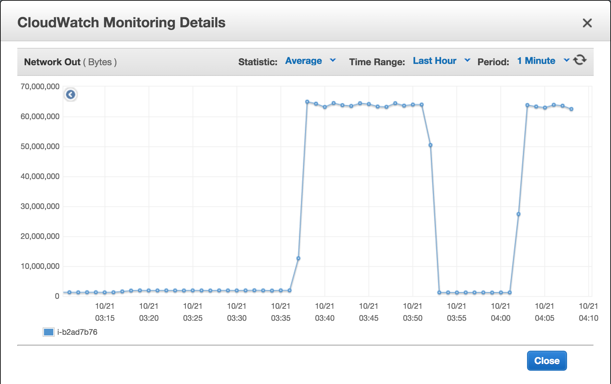
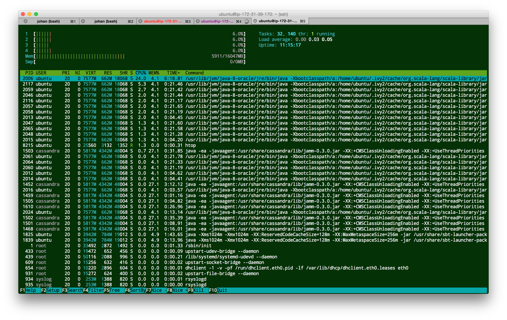
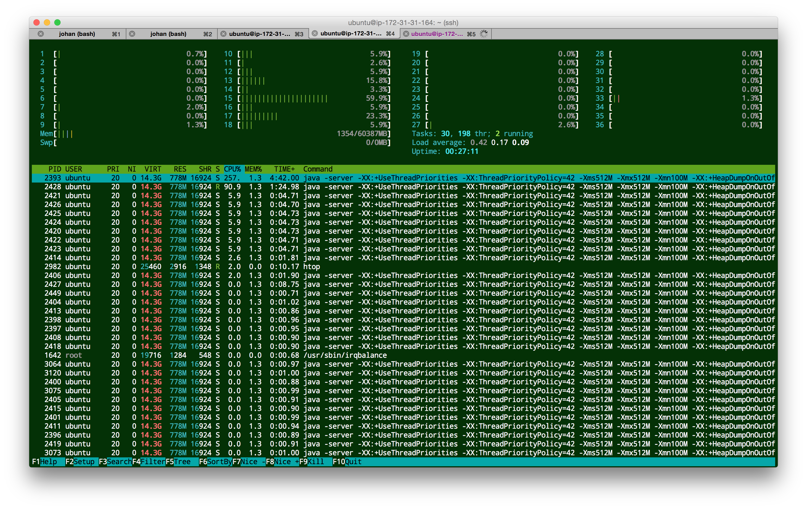
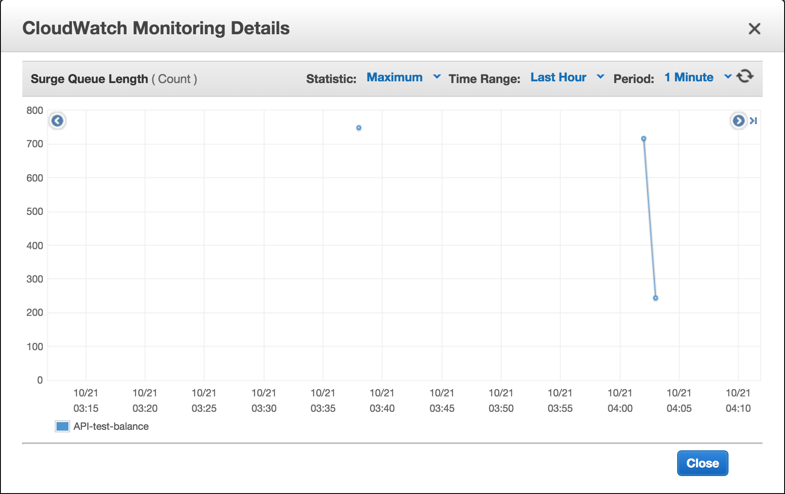

## Prototype Streaming API's

###Problem Statement
The SaaS Platform dynamically creates very chatty resources (guest cluster instances) that may live for 10 minutes or 10 months. There may be *many* of these resources, however, they typically have a limited number of users monitoring them. The standard RESTful way of providing information about these resources lead to a lot of traffic and lag. 

###Proposed Design
We propose a design that mixes traditional REST API's and Streaming API's and investigate the performance.

The **Emitters** are created dynamically (simulating SaaS guest cluster launches) using a REST PUT call. When clients call GET stream API's a subscription is created to the Emitter. These subscriptions span the Platform cluster - the API Stream may served from a different node than the Emitter (great for load balancing).

####REST PUT to create a resource
This simulates a guest system launch - a resource that creates an very active event emitter. The instance log is a good example.

####REST GET is available for clients that do not deal with streams



####Streaming API subscription through a GET 


####API
The following endpoints are available:

* ``localhost:9000`` -> redirects to
* ``localhost:9000/livedoc``
* PUT ``localhost:9000/log``  Create a Log Emitter and return an emitter ``{id}``
* GET ``localhost:9000/log/{id}``  Return a page of recent log events
* GET ``localhost:9000/sse/log/{id}``  SSE stream of log events for emitter ``{id}``
* GET ``localhost:9000/magic``  SSE stream of magic numbers
* GET ``localhost:9000/time``   SSE stream time stamps
* WS-CONNECT ``ws://localhost:9000/echo`` WebSocket echo

#### API Live Doc
Documentation for the ``log`` API's:
[http://localhost:9000/livedoc](http://localhost:9000/livedoc)



####The Test Server:

```bash
user in ~/proto-platform-sse-stream on master*
λ sbt
[info] Loading global plugins from /Users/johan/.sbt/0.13/plugins
[info] Loading project definition from /proto-platform-sse-stream/project/project
[info] Set current project to root (in build file:/proto-platform-sse-stream/)
> re-start
[info] Starting application platform in the background ...
platform Starting com.example.Server.main()
:
```

####Test Clients

#####Curl / HTTPie
```bash
λ http -v --stream localhost:9000/magic
GET /magic HTTP/1.1
Accept: */*
Accept-Encoding: gzip, deflate
Host: localhost:9000
User-Agent: HTTPie/0.8.0


HTTP/1.1 200 OK
Connection: close
Content-Type: text/event-stream
Date: Fri, 16 Oct 2015 22:12:06 GMT
Server: akka-http/2.4.0

data:{"magic":-2762725995429886737,"timestamp":"2015-10-16T22:12:07Z"}
data:{"magic":-5287357773570930940,"timestamp":"2015-10-16T22:12:07Z"}
data:{"magic":-7618002225400462060,"timestamp":"2015-10-16T22:12:07Z"}
data:{"magic":1644628982439445801,"timestamp":"2015-10-16T22:12:08Z"}
```

#####Chrome
* [http://localhost:9000/magic](http://localhost:9000/magic)
* [http://localhost:9000/time](http://localhost:9000/time)


#####The Akka / Play client

```bash
λ sbt portal/run
[info] Loading global plugins from .sbt/0.13/plugins
[info] Loading project definition from proto-platform-sse-stream/project/project
[info] Loading project definition from proto-platform-sse-stream/project
[info] Set current project to root (in build file:/proto-platform-sse-stream/)
[warn] Multiple main classes detected.  Run 'show discoveredMainClasses' to see the list

Multiple main classes detected, select one to run:

 [1] com.example.MagicClient
 [2] com.example.TimeClient

Enter number: 1

[info] Running com.example.MagicClient
15:16:19.879 data:{"magic":-8795067486701477036,"timestamp":"2015-10-16T22:16:19Z"}
15:16:20.110 data:{"magic":4439052364899773985,"timestamp":"2015-10-16T22:16:20Z"}
15:16:20.348 data:{"magic":7494022577714905587,"timestamp":"2015-10-16T22:16:20Z"}
15:16:20.610 data:{"magic":808692799200808740,"timestamp":"2015-10-16T22:16:20Z"}

```


##Performance Measurement
The goal is to generate a single baseline data point for the streaming API in Akka http.

###Setup
1. The API server on a M4 XLarge (4 core) similar to the modest nodes we launch as part of the Platform cluster. 
2. EC2 Load Balancer - terminates TLS traffic
3. The test load generator - runs [Gatling](http://gatling.io/) to generate network load. On a C4 8XLarge (36 core 10 Gbit network I/O)

####Test Scenario

```scala
class Sseload extends Simulation {
val httpConf = http
  .baseURL("https://api-test.modeler.gy")

val scn = scenario("ServerSentEvent")
  .exec( sse("StreamingLogEvents")
    .open("/log/sse/1")
    .check( wsAwait.within(4000 seconds).until(1000) )
    )
  .exec(sse("CloseSSE").close())

  setUp(
  	scn.inject(atOnceUsers(1000))
    ).protocols(httpConf)
}
```

This simulates 1000 users subscribing to the stream and extracting 1000 events.
###Results
**Bottom line result:** The test completes successfully in the expected 500 seconds (given the emitter rate on the API server). 

#### API Network out flow


####Server Load


####Tester Load


####Load Balancer Queue Size

The load balancer warms up toward the end of the test (surge queue goes from 700 to 200) - a tip for more in-depth tests: Tests should be longer than a couple of minutes.