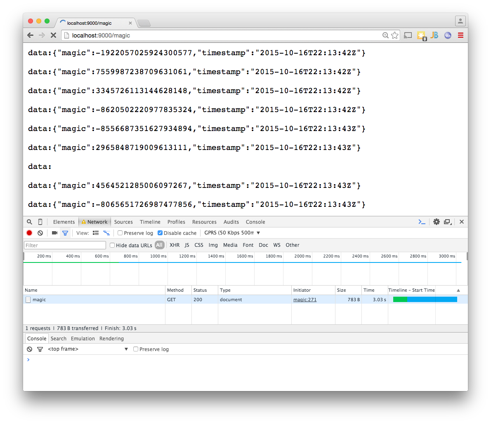

 ## Prototype Streaming API's

####The Test Server:

```bash
user in ~/proto-platform-sse-stream on master*
λ sbt
[info] Loading global plugins from /Users/johan/.sbt/0.13/plugins
[info] Loading project definition from /proto-platform-sse-stream/project/project
[info] Set current project to root (in build file:/proto-platform-sse-stream/)
> re-start
[info] Starting application platform in the background ...
platform Starting com.example.Server.main()
:

```

The following endpoints are now avaiable:

* ``localhost:9000`` -> redirects to
* ``localhost:9000/livedoc``
* ``localhost:9000/magic``  SSE stream of magic numbers
* ``localhost:9000/time``   SSE stream time stamps
* ``ws://localhost:9000/echo`` WebSocket echo

####Test Clients

#####Curl / HTTPie
```bash
λ http -v --stream localhost:9000/magic
GET /magic HTTP/1.1
Accept: */*
Accept-Encoding: gzip, deflate
Host: localhost:9000
User-Agent: HTTPie/0.8.0


HTTP/1.1 200 OK
Connection: close
Content-Type: text/event-stream
Date: Fri, 16 Oct 2015 22:12:06 GMT
Server: akka-http/2.4.0

data:{"magic":-2762725995429886737,"timestamp":"2015-10-16T22:12:07Z"}
data:{"magic":-5287357773570930940,"timestamp":"2015-10-16T22:12:07Z"}
data:{"magic":-7618002225400462060,"timestamp":"2015-10-16T22:12:07Z"}
data:{"magic":1644628982439445801,"timestamp":"2015-10-16T22:12:08Z"}
```

#####Chrome


#####The Akka / Play client

```bash
λ sbt portal/run
[info] Loading global plugins from .sbt/0.13/plugins
[info] Loading project definition from proto-platform-sse-stream/project/project
[info] Loading project definition from proto-platform-sse-stream/project
[info] Set current project to root (in build file:/proto-platform-sse-stream/)
[warn] Multiple main classes detected.  Run 'show discoveredMainClasses' to see the list

Multiple main classes detected, select one to run:

 [1] com.example.MagicClient
 [2] com.example.TimeClient

Enter number: 1

[info] Running com.example.MagicClient
15:16:19.879 data:{"magic":-8795067486701477036,"timestamp":"2015-10-16T22:16:19Z"}
15:16:20.110 data:{"magic":4439052364899773985,"timestamp":"2015-10-16T22:16:20Z"}
15:16:20.348 data:{"magic":7494022577714905587,"timestamp":"2015-10-16T22:16:20Z"}
15:16:20.610 data:{"magic":808692799200808740,"timestamp":"2015-10-16T22:16:20Z"}

```
